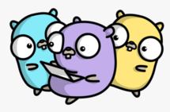

# microservice-template
 **Complete Over-engineered Golang Microservice Template**

## Features
- Golang Server
    - [x] Static compiling
    - [ ] Clean Architecture
    - [x] Golang standard layout
    - [ ] Complete Mock testing
    - [x] Makefile
    - [x] Styling checks with GolangCI-Lint
    - [x] Dockerfile
    - [x] Echo Web Framework
    - [ ] Plain sql or GORM
        - [ ] Migration manager as golang-migrate
        - [ ] Embeded migrations with go-bindata
    - [x] Panic-Recovery
    - [x] Logrus
    - [ ] Custom errors
    - [ ] Documentation (Grindsome Docc)
    - [ ] Automatic Locales Internationalization
    - [x] Graceful shutdown
    - [ ] Casbin RBAC Auth Controller
    - [ ] Load tester as Vegeta
- Security
    - [ ] AutoTLS with Let's Encrypt
    - [ ] CORS management
    - [ ] Services protected with Authorization
    - [ ] AWS Secret Manager for environmental variables
    - [ ] Different database users for admin, app and metrics
    - [ ] Gosec automatic checks
- Services
    - [x] Docker-Compose that inits all services
    - [x] Postgres
    - [x] PgAdmin4 (Note: don't use this in prod)
    - [x] Metabase
    - [x] Prometheus
    - [x] Jaeger
    - [x] Grafana
    - [ ] NewRelic
    - [x] Sentry (SaaS)
        - [ ] Sentry (Self-Hosted)
    - [ ] Celery or other distributed task system
    - [ ] Redis cache
    - [ ] Swagger
    - [ ] Weblate/Traduora (Self-Hosted)
    - [ ] Fossa
    - [ ] Helm charts for deployment
    - [ ] Nginx/Traefik for load balancing
    - [ ] Codecov or similar
    - [ ] Terraform plan

## Setup
- Install:
    - [`golang 1.14.2 >=`](https://golang.org/dl/)
    - [`docker 19.03.6 >=`](https://docs.docker.com/get-docker/)
    - [`docker-compose 1.21.0 >=`](https://docs.docker.com/compose/install/)
- In the project root directory:
    - Create an `.env` file with:
        - `DATABASE_USER`
        - `DATABASE_PASSWORD`
        - `SENTRY_DSN` (Optional)
        - `NEWRELIC_LICENSEKEY` (Optional)
    - Run `make build` and then `make start`

See `makefile` for further commands.

## Architecture
The project uses a subset of the Clean Architecture, composed of 3 different layers: **Dto**->**Entity**->**Model**, which are disjoint and the dependencies are unidirectional towards the database domain.

Use Case handlers are created at launch time, meaning that only a single DB connection pool is created. It will be used to create all kind of repositories, that will then be injected to each **Use Case**. That means that **Repositories** and **Handlers** must be thread safe to attend different requests.

## Structure
Follows the [Standard Go Project Layout](https://github.com/golang-standards/project-layout).
```
.
├── assets
│   ├── images
│   └── locale
├── build
├── cmd
│   └── mst
├── configs
├── deploy
├── init
├── internal
│   ├── database
│   │   └── migrations
│   ├── entity
│   │   └── cookie
│   ├── errors
│   ├── handler
│   │   ├── cookie
│   │   └── health
│   ├── middleware
│   ├── repository
│   │   └── cookie
│   └── server
├── pkg
│   └── fortune
└── scripts
```

### `/assets`
Static files to be served by the application.

### `/build`
Packaging and Continuous Integration cofigurations.

### `/cmd`
Main entrypoint for the microservice. Just a small `main` functions that invokes code from `/internal` and `/pkg` and starts the application.

### `/configs`
Configuration file templates.

### `/deploy`
System or container orchestration and Continuous Deployment configurations.

### `/init`
System init configuration for once or everytime.

### `/internal`
Private application code that other projects won't import.

### `/pkg`
Public library code that other external projects could import.

### `/scripts`
Scripts to perform various build, install, analysis, etc operations. These scripts keep the root level Makefile small and simple.

## License
This project is licensed under the [MIT License](https://opensource.org/licenses/MIT) - read the [LICENSE](LICENSE) file for details.
